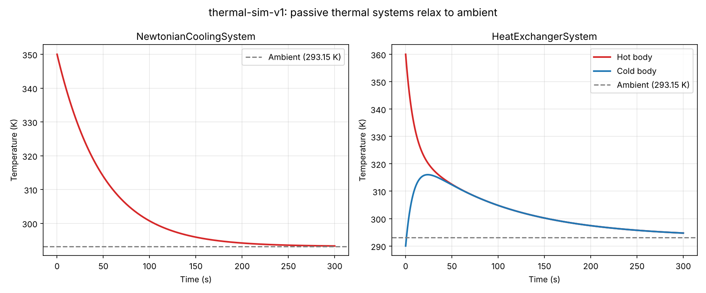
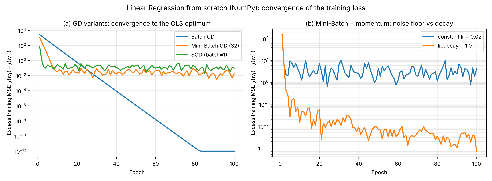

# thermal-sim-v1

[](https://github.com/Hooman-Jericho/thermal-sim-v1/actions/workflows/ci.yml)


A small, physics-checked simulation of thermal systems, plus the
from-scratch machine-learning code and baseline experiments built on top of
it. It is the foundation of an MSc thesis on **safe reinforcement learning
for energy-optimal control of an industrial thermal system** (SAC with a
physics-informed reward and a Control Barrier Function safety layer).

The design goal is to be **grown, not rewritten**: the same
`reset()` / `step()` interface used here becomes the Gymnasium environment
(`thermal_env.py`) later, with a reward function and safety layer added on
top of the unchanged physics.



## What is in the repository

| Part | Where | What it gives you |
|---|---|---|
| Simulation core | `src/core.py` | `ThermalSystem` (abstract base class), `SystemState`, fixed-step forward-Euler loop, seeded RNG, Euler-stability guard |
| Passive systems | `src/systems.py` | `NewtonianCoolingSystem` (has a closed-form solution used to validate the integrator), `HeatExchangerSystem` (two coupled bodies) |
| Actuated plant | `src/plant.py` | `ActuatedThermalPlant`: heater input `u` and unmeasured disturbance `d`; the plant the RL policy will later control |
| ML from scratch | `src/ml_scratch/` | Linear and logistic regression trained by batch / mini-batch / SGD with momentum, L1/L2, lr decay and early stopping; verified against scikit-learn |
| Baseline study | `experiments/baseline_dynamics_learning/` | Linear / Random Forest / SVR models that learn the plant dynamics, with episode-grouped splits and a safety stress test (see its README) |

The physics of the actuated plant is a single lumped energy balance:

$$ mC_p \, \frac{dT}{dt} = u(t) - k_{loss}\,\bigl(T - T_{amb}\bigr) - d(t) $$

where $u$ is the heater power (W), $d$ an unmeasured load disturbance (W),
$k_{loss}$ the heat-loss coefficient (W/K) and $mC_p$ the thermal capacity
(J/K). It is integrated with forward Euler, which is only stable for
$\Delta t \cdot k_{loss}/mC_p < 2$; the code enforces that and raises a clear
error otherwise.

## Gradient descent from scratch

Batch GD converges geometrically to the exact least-squares optimum.
Mini-batch GD with a constant learning rate stalls on a noise floor, and an
inverse-time decay removes it. The figure is produced by
`make figures` and the same behaviour is asserted in the test suite.



## Quick start

```bash
python3 -m venv .venv && source .venv/bin/activate
make setup-dev            # runtime + dev tools
make test                 # 198 tests
python simulate.py        # writes outputs/thermal_sim_v1_demo.png
```

The repository convention is `PYTHONPATH=.` with `from src.<module> import
...` (no packaging step); the `Makefile` sets it for every target.
Nothing requires a Weights & Biases login: the pipelines default to offline
mode.

```python
from src.plant import ActuatedThermalPlant, PlantConfig

plant = ActuatedThermalPlant(PlantConfig(mCp=500.0, k_loss=5.0, T_amb=25.0), seed=0)
for _ in range(300):
    plant.step(u=100.0, d=plant.sample_disturbance(std=5.0))
print(plant.state.temperatures["T"])
```

## Quality gates

Every pull request runs the same three commands locally and in CI
(`.github/workflows/ci.yml`):

| Gate | Command | Tool |
|---|---|---|
| Style, imports, bugbear, docstrings (NumPy convention), annotations | `make lint` | `ruff check`, `ruff format --check`, `flake8` |
| Static types | `make typecheck` | `mypy` in `strict` mode |
| Behaviour | `make test` | `pytest` |

`make check` runs all three. Line length is 88 (PEP 8 allows a
team-agreed limit up to 99); the tool settings live in `ruff.toml`,
`mypy.ini` and `.flake8`. Optional pre-commit hooks: `pre-commit install`.

Tests check the **physics**, not just that the code runs: the numerical
simulation is compared with the analytic Newton-cooling solution, energy is
conserved in the two-body exchanger when ambient loss is off, the
from-scratch regressors are compared with scikit-learn (including Ridge and
Lasso under the exact `alpha` mapping), and every input-validation path
(non-positive capacities, unstable time steps, non-finite data, diverging
training, unfitted models) has a test.

## Repository layout

```
thermal-sim-v1/
├── src/
│   ├── core.py            # ThermalSystem ABC, SystemState, Euler loop
│   ├── systems.py         # NewtonianCoolingSystem, HeatExchangerSystem
│   ├── plant.py           # ActuatedThermalPlant (heater u, disturbance d)
│   └── ml_scratch/        # GD-based linear / logistic regression + plots
├── experiments/
│   └── baseline_dynamics_learning/   # classical-ML baseline study
├── tests/                 # pytest suite mirroring src/ and experiments/
├── docs/                  # figures used in this README
├── simulate.py            # demo: both passive systems -> outputs/*.png
├── Makefile               # setup, lint, typecheck, test, figures, pipelines
├── ruff.toml  mypy.ini  .flake8  .pre-commit-config.yaml
└── .github/workflows/ci.yml
```

## Roadmap

- [x] Object-oriented thermal simulation with analytic validation
- [x] Actuated plant with seeded disturbance
- [x] Gradient descent, linear and logistic regression from scratch
- [x] Classical-ML baselines and safety stress test
- [ ] Gymnasium environment `thermal_env.py` that passes `check_env`
- [ ] Physics-informed reward and domain randomization
- [ ] Control Barrier Function (QP) safety layer
- [ ] SAC / PPO / TD3 against PID and MPC baselines, with statistics over
      multiple seeds

## License

MIT, see [LICENSE](LICENSE).
